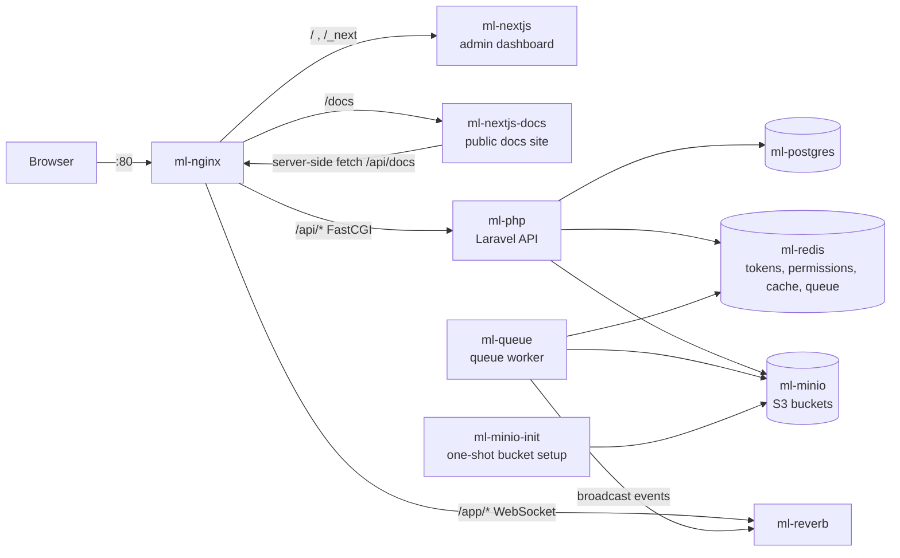
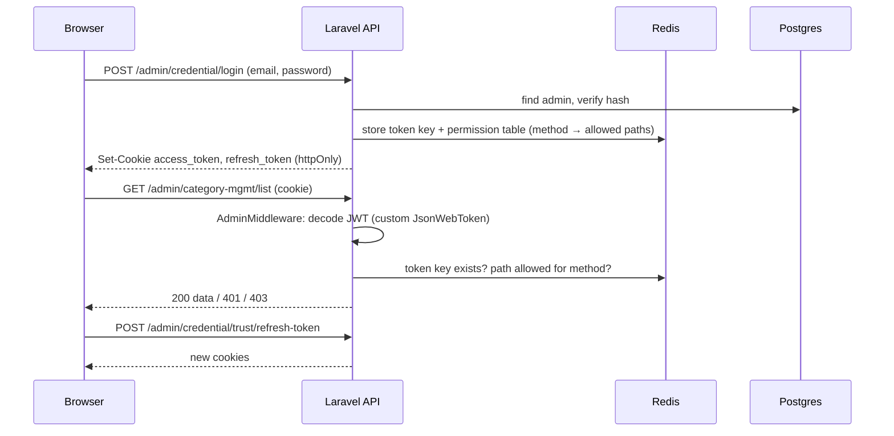

# As-is architecture — `v1.0.0` legacy baseline (2026-10-07)

> 🇻🇳 Kiến trúc hiện tại tại thời điểm `v1.0.0`, trước khi cắt giảm. Tài liệu này là ảnh chụp lịch sử: không cập nhật sau Phase 2, kiến trúc mới sẽ có file riêng.

This is a snapshot of the system before the Engineering Lab changes. It is frozen: after Phase 2 a new `to-be.md` describes the new shape, and this file stays as the "before" picture.

> 🇻🇳 Đây là ảnh chụp hệ thống trước khi thay đổi. Sau Phase 2 sẽ có `to-be.md` mô tả hình dạng mới; file này giữ làm hình "trước".

## 1. Containers

| Container | Role |
|---|---|
| `ml-nginx` | Single entry point; routes by path |
| `ml-nextjs` | Admin dashboard (Next.js 16, TanStack Query) |
| `ml-nextjs-docs` | Public docs site rendering CMS content |
| `ml-php` | Laravel 13 API (PHP-FPM) |
| `ml-queue` | Background jobs: large-file processing, stuck-upload cleanup |
| `ml-reverb` | WebSocket server: upload status and media move events |
| `ml-postgres` / `ml-redis` / `ml-minio` | Data, cache + sessions + queue, object storage |

## 2. API surface

> 🇻🇳 Bề mặt API.

| Group | Prefix | Auth | Resources |
|---|---|---|---|
| Credential | `/api/admin/credential` | login / refresh public, others admin | `login`, `trust/refresh-token`, `trust/logout`, `me` |
| Master data | `/api/admin/*-mst` | admin + permission check | admins, roles, departments, features, APIs, tokens, policy-departments + 4 junction tables |
| Management data | `/api/admin/*-mgmt` | admin + permission check | banners, categories, entries, entry descriptions, sliders, socials, users, setting links, media (multipart upload) |
| History | `/api/admin/*-hist` | admin | one history list per entity |
| Public docs | `/api/docs` | none | categories, entries by category, entry detail, search |

Resource routes follow one pattern: `GET {r}/list`, `POST {r}/store`, `PUT {r}/update/{id}`, `POST {r}/delete`, served by a generic CRUD core (`BaseCrudController` / `BaseCrudService` / `BaseRepository`).

> 🇻🇳 Route theo một khuôn chung, phục vụ bởi lõi CRUD dùng chung.

## 3. Authentication and authorisation (custom)

> 🇻🇳 Xác thực và phân quyền (tự viết).

Permissions come from a chain of tables: admin → roles → APIs (`api_role_mst`) plus departments → policies, flattened by DB views (`admin_permission_view`, `admin_policy_view`) and kept in sync by DB triggers (`after_api_insert`, `after_policy_department_insert`). Known defect: a deleted admin can still refresh tokens (AUTH-GUIDE A13).

> 🇻🇳 Quyền đi qua chuỗi bảng admin → role → API cùng department → policy, được làm phẳng bằng view và đồng bộ bằng trigger trong DB. Lỗi đã biết: admin bị xoá vẫn refresh được token.

## 4. Data model (summary)

> 🇻🇳 Mô hình dữ liệu (tóm tắt).

| Group | Tables |
|---|---|
| Identity & RBAC (`*_mst`) | `admin_mst`, `role_mst`, `admin_role_mst`, `feature_mst`, `api_mst`, `api_role_mst`, `department_mst`, `admin_department_mst`, `policy_department_mst`, `department_management_mst`, `token_mst` |
| Content (`*_mgmt`) | `category_mgmt` → `entry_mgmt` → `entry_description_mgmt` (with JSON `layout_structure`), `slider_mgmt`, `banner_mgmt`, `setting_link_mgmt`, `social_mgmt`, `user_mgmt`, `media_mgmt` |
| History (`*_hist`) | 14 tables, one per audited entity, written by `AuditedCrudService` |
| Framework | `users`, `cache`, `jobs` |
| DB logic | 2 triggers, 2 views |

Conventions: soft delete via `is_delete` flag; `status` / `rank_order` integers; timestamps stored as strings in several legacy tables.

> 🇻🇳 Quy ước: xoá mềm bằng cờ `is_delete`; một số bảng cũ lưu thời gian dạng chuỗi.

## 5. Delivery

> 🇻🇳 Quy trình đưa code lên môi trường.

| Stage | How |
|---|---|
| Local | `make up` (Docker Compose), `make verify` |
| CI | GitHub Actions `ci.yml`: frontend (lint, format, typecheck, Vitest with coverage gate), backend (Pint, Larastan 6, PHPUnit), Docker build, prod dependency audit |
| CD | `cd.yml`: on push to `developer`, build images tagged by SHA, deploy blue-green on a self-hosted runner (`ci-cd/deploy.sh`) |
| Backup | `backup/backup.sh`: `pg_dump -Fc` + `mc mirror` + `.env` → tar.gz → rclone to several clouds, 3-day retention |

## 6. Size

> 🇻🇳 Quy mô.

| Part | Size |
|---|---|
| Backend `app/` | ~20.6k lines PHP |
| Backend tests | ~21.1k lines, 598 tests |
| Admin FE `src/` | ~30.2k lines TS/TSX, 106 Vitest tests |
| Docs site `src/` | ~2k lines |
| Migrations | 52 |
