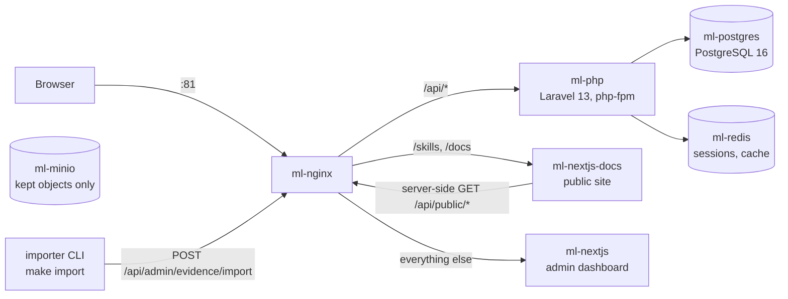
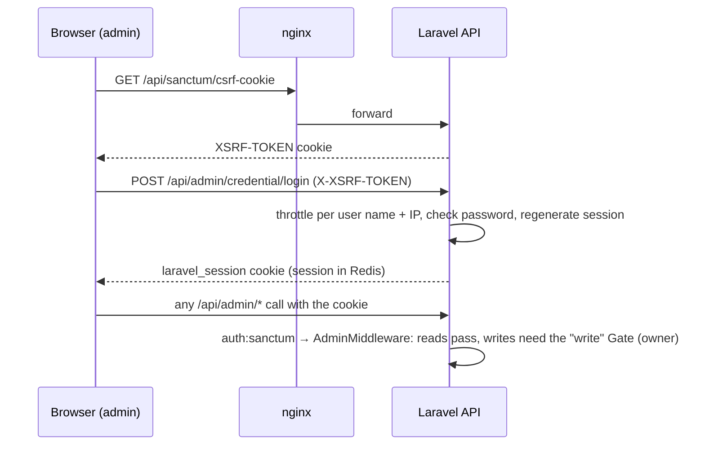
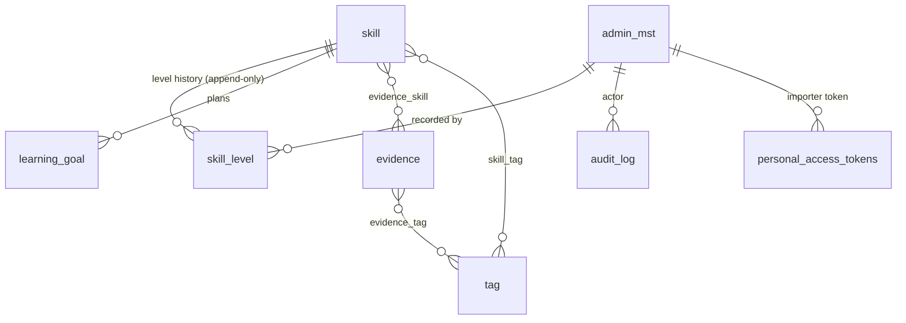

# Current architecture — Skill Ledger (2026-10-09)

> 🇻🇳 Kiến trúc hiện tại: hệ thống đang chạy thế nào sau P3 (Skill Ledger) và phần đã xong của P4 (IaC). Cập nhật khi kiến trúc thay đổi; lần cập nhật lớn tiếp theo là P4-12.

The system as it runs today: after P2 (slim-down, `v2.0.0`), P3 (Skill Ledger, `v2.1.0`) and the finished part of P4 (production images, queue / websocket removal, the first Terraform stack). It replaces the "to-be" picture that [as-is.md](as-is.md) promised; as-is stays frozen as the `v1.0.0` "before". This file is living: update it in the change that alters what it describes. P4-12 revises it at the P4 close.

> 🇻🇳 Hệ thống như đang chạy hôm nay. File này thay cho bản "to-be" mà as-is.md hứa; as-is vẫn giữ nguyên làm ảnh "trước". File sống: sửa cùng commit làm thay đổi kiến trúc; P4-12 cập nhật lần lớn.

## 1. Containers (dev, Docker Compose)

> 🇻🇳 Các container ở môi trường dev. Mọi request vào qua nginx cổng 81.

| Container | Role |
|---|---|
| `ml-nginx` | the only entry point (host :81 → 8080 inside); routing in `docker/nginx/default.conf`, rate limits for the API |
| `ml-php` | REST API; migrates and seeds an empty database on start |
| `ml-nextjs` | admin dashboard (client components) |
| `ml-nextjs-docs` | public site (server components; calls the API through nginx, results cached 60 s) |
| `ml-postgres` | data and full-text / trigram search; a separate `testing` database for PHPUnit |
| `ml-redis` | sessions and cache (tests use DBs 14 / 15) |
| `ml-minio` (+ `ml-minio-init`) | holds the objects of the removed media feature; no code reads it, `backup.sh` mirrors it ([ADR-0007](../adr/0007-remove-media-api.md)) |

Gone since `v1.0.0`: the queue worker and the Reverb websocket server (nothing queues or broadcasts, API-05 / P4-04), the CMS modules ([ADR-0003](../adr/0003-remove-cms-modules.md)), the media API ([ADR-0007](../adr/0007-remove-media-api.md)), the custom JWT auth ([ADR-0004](../adr/0004-sanctum-spa-cookie-auth.md)).

> 🇻🇳 Đã bỏ so với `v1.0.0`: queue worker, Reverb, module CMS, API media, JWT tự viết.

## 2. API surface

> 🇻🇳 Các nhóm API. Hợp đồng đầy đủ: `laravel-api/openapi.json`.

| Group | Routes | Access |
|---|---|---|
| Auth | `GET /api/sanctum/csrf-cookie`, `POST /api/admin/credential/{login,logout}`, `GET /api/admin/credential/me` | session cookie |
| Admin accounts | `/api/admin/admin-mst/{list,store,update/{id},delete}` | `owner` writes, `viewer` reads |
| Skill Ledger | `/api/admin/{skill,tag,evidence,learning-goal}/…`, `skill-level/{list,store}`, `search`, `dashboard/summary` | same |
| Audit | `GET /api/admin/audit-log/list` | read-only |
| Import | `POST /api/admin/evidence/import` | API token with ability `evidence:import` only, 10 runs / minute |
| Public | `GET /api/public/skills`, `GET /api/public/skills/{slug}` | anyone, rate-limited per IP |

One response envelope everywhere: `{ "data": …, "error": { "status", "code", "messages" } }`. The OpenAPI spec is generated from the code; every test request is validated against it and the admin FE types are generated from it ([ADR-0008](../adr/0008-code-first-openapi-contract.md)).

> 🇻🇳 Một envelope cho mọi response. Spec OpenAPI sinh từ code; mọi request trong test được kiểm tra theo spec; type FE sinh từ spec.

## 3. Authentication and authorisation

> 🇻🇳 Xác thực và phân quyền.

- **Session auth** (Laravel Sanctum SPA, [ADR-0004](../adr/0004-sanctum-spa-cookie-auth.md)): the cookie and the XSRF header, no tokens in the browser.
- **Roles** ([ADR-0005](../adr/0005-owner-viewer-roles.md)): `owner` and `viewer` (a read-only demo account); 401 = no session, 403 = a viewer writing. The last active owner cannot be demoted, disabled or deleted.
- **API token** ([ADR-0010](../adr/0010-python-importer-tooling.md)): a Sanctum personal access token minted with `php artisan ledger:import-token`; it opens only the import route.
- **Audit** ([ADR-0006](../adr/0006-audit-log.md)): one `audit_log` table; every create / update / delete, login, logout and failed login writes a row (changed fields only, never secrets).

> 🇻🇳 Session cookie (Sanctum), 2 vai trò owner / viewer, token API chỉ mở được route import, mọi thao tác ghi đều có dòng audit.

## 4. Data model

> 🇻🇳 Mô hình dữ liệu. Chi tiết cột: RFC-002 §4.2.

| Table | Purpose |
|---|---|
| `skill`, `skill_level`, `learning_goal`, `evidence`, `tag` (+ 3 link tables) | the Skill Ledger ([RFC-002 §4.2](../design/RFC-002-skill-ledger.md#42-data-model-to-be-v210)); `skill.current_level` is refreshed from the newest `skill_level` row |
| `admin_mst` | admin accounts with `role` |
| `audit_log` | who changed what, and every login attempt |
| `personal_access_tokens` | importer tokens |
| `sessions`, `cache`, `cache_locks` | Laravel framework tables (sessions themselves live in Redis) |
| `media_mgmt` | data kept from the removed media feature (ADR-0007), no code reads it |

Search ([ADR-0009](../adr/0009-postgres-search.md)): stored `search_tsv` columns with GIN indexes for full text (with `unaccent`, so Vietnamese typed without diacritics matches) and GiST trigram indexes for typos, on `skill` and `evidence`. No separate search engine.

> 🇻🇳 Tìm kiếm: cột `search_tsv` lưu sẵn + GIN cho full text (có `unaccent` để gõ không dấu vẫn khớp), GiST trigram cho lỗi chính tả. Không dùng search engine riêng.

## 5. Environments and delivery

> 🇻🇳 Môi trường và cách đưa code lên.

| Stage | How |
|---|---|
| Dev | Docker Compose (`make up`), bind-mounted source, dev servers ([docker/README.md](../../docker/README.md)) |
| Quality gate | `make verify` locally (lint, Larastan, OpenAPI drift, type checks, PHPUnit, Vitest, pytest) and `make e2e`; GitHub Actions CI / CD are paused until P5 (manual dispatch only) |
| Production-like | Terraform with the Docker provider runs the production images as `sm-<env>-*` on the same engine (`prod-like` on :9443; `staging` in P4-07) ([ADR-0011](../adr/0011-infrastructure-as-code.md), [infra/README.md](../../infra/README.md)) |
| Images | built from committed code by `make tf-images`: `sm-api` 242 MB, `sm-nextjs-fe` 307 MB, `sm-nextjs-docs` 300 MB; Laravel caches built at container start |
| Backup | `make backup`: `pg_dump` + MinIO mirror + `docker/.env` → rclone remotes, 3-day retention; test-restore mode ([runbook](../runbooks/backup-restore.md)) |
| Content | Obsidian notes with `publish: true` → `make import` → evidence ([runbook](../runbooks/ledger-import.md)) |

## 6. Measured numbers

> 🇻🇳 Số liệu đo được.

| What | Value | Source |
|---|---|---|
| Load, 10 users | ~116–134 req/s, 0 % errors (first baseline 55–69) | [re-baseline](../reports/perf/2026-10-08-rebaseline.md) |
| Search p95 | 123–144 ms (target < 300 ms) | same |
| Backend | ~5.9k lines PHP in `app/`, 166 PHPUnit tests, 67 migrations | `make verify`, 2026-10-09 |
| Admin FE | ~13k lines TS/TSX, 70 Vitest tests | same |
| Public site / importer | ~0.4k lines TS / ~0.5k lines Python, 63 pytest tests | same |

> 🇻🇳 So với `v1.0.0` (as-is §6): backend ~20.6k → ~5.9k dòng, admin FE ~30.2k → ~13k dòng sau khi cắt giảm.
