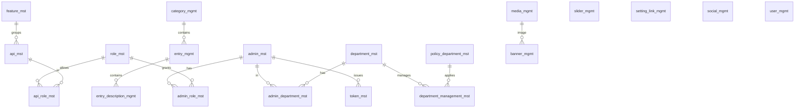
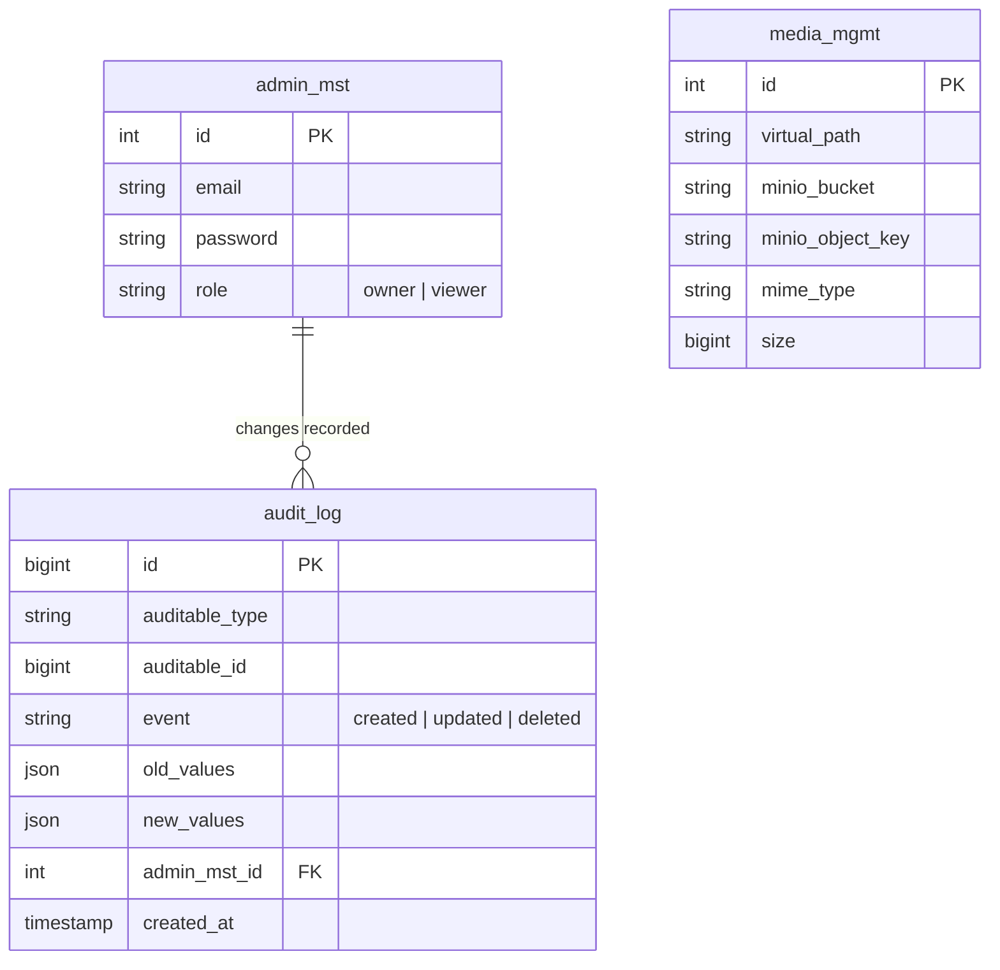

# RFC-001 — Slim down: remove the CMS, simplify auth, roles and history

> 🇻🇳 Thiết kế cho việc cắt giảm ở Phase 2: xoá CMS, đơn giản hoá auth, phân quyền và lịch sử.

| | |
|---|---|
| Status | Approved (TL, 2026-10-07) |
| Author | TL / Dev |
| Reviewers | PO (scope), QA (test plan), Ops (rollout) |
| Related | [REQ-001](../requirements/REQ-001-slim-down.md), [ADR-0003](../adr/0003-remove-cms-modules.md), PRB-001 / ADR-0004 (auth), ADR-0005 (roles), ADR-0006 (audit log) |

## 1. Summary

Remove every module that only served content authoring or page decoration, export existing content to Markdown first, replace the hand-written JWT auth with Laravel Sanctum, collapse the role → feature → API permission chain into two roles, and replace the per-entity history tables with one audit log. Delivered as ten small, revertible slices and released as `v2.0.0`.

> 🇻🇳 Xoá mọi module chỉ phục vụ viết nội dung hoặc trang trí trang; xuất nội dung cũ ra Markdown trước; thay JWT tự viết bằng Sanctum; gộp chuỗi phân quyền thành hai vai trò; thay các bảng lịch sử riêng lẻ bằng một audit log. Chia thành 10 lát nhỏ, đảo ngược được, release thành `v2.0.0`.

## 2. Goals and non-goals

**Goals:** fulfil REQ-001 US-1…US-5; every slice leaves `make verify` green; no loss of content (export) or stored files.
**Non-goals:** new features (Skill Ledger is REQ-002); infrastructure changes (P4); a public demo account UI (only the `viewer` role is created here).

## 3. Impact analysis (P2-02)

> 🇻🇳 Phân tích ảnh hưởng — mỗi module chạm tới những gì.

| Module | Backend files (app/) | Tests | Tables (+ history) | Routes | Admin FE | Other dependencies |
|---|---|---|---|---|---|---|
| Sliders | 18 | 8 | `slider_mgmt` (+hist) | 4 + 1 hist | page + form | – |
| Banners | 18 | 8 | `banner_mgmt` (+hist) | 4 + 1 hist | page + form | FK `media_id` → `media_mgmt` (drop with table) |
| Setting links | 18 | 8 | `setting_link_mgmt` (+hist) | 4 + 1 hist | page + form | – |
| Socials | 18 | 9 | `social_mgmt` (+hist) | 4 + 1 hist | page + form | – |
| End users | 18 | 4 | `user_mgmt` (+hist) | 4 + 1 hist | page + form | Uses `AvatarUpload` (component stays for admins) |
| Departments & policies | ~43 | 9 | `department_mst`, `admin_department_mst`, `policy_department_mst`, `department_management_mst` (+2 hist) | 10 + 2 hist | 2 pages + forms, admin-form department field | View `admin_policy_view` (**unused by code**), trigger `after_policy_department_insert`, `RootAccountSeeder` |
| Content CMS | ~56 | 24 | `category_mgmt`, `entry_mgmt`, `entry_description_mgmt` (+3 hist) | 12 + 3 hist + 4 public docs | 3 pages, `features/content` (editor, layout editor) | Docs site reads `/api/docs/*`; seeders `CategoryMgmtSeeder`, `EntryMgmtSeeder`, `EntryDescriptionMgmtSeeder` |
| File-manager UI | – | – | none (keeps `media_mgmt`) | none removed in the first step | `/admin/file-manager`, `features/media` explorer | Avatar upload uses the media upload API → **API stays** |
| Custom auth | `CredentialService`, `JsonWebToken`, `AdminMiddleware`, `BroadcastingAuthMiddleware`, `token_mst` | auth tests | `token_mst` (+hist) | credential routes, token CRUD | `auth-provider`, login page, tokens page | Redis permission table per token; Reverb channel auth |
| Role → feature → API RBAC | role/feature/API/junction services | ~many | `role_mst`, `admin_role_mst`, `feature_mst`, `api_mst`, `api_role_mst` (+3 hist) | 20+ | roles wizard, features, APIs pages | View `admin_permission_view` (**used by login**), trigger `after_api_insert` |
| Per-entity history | 14 controllers/services/repos + requests | per entity | 14 `*_hist` | 14 | `features/history` viewer | `AuditedCrudService` |

Totals before the change are in §9 (P2-05).

> 🇻🇳 Phát hiện quan trọng: view `admin_policy_view` không được code nào dùng, nên department/policy xoá độc lập được. View `admin_permission_view` thì login đang dùng, nên chỉ gỡ được sau khi chuyển sang Sanctum. API upload media phải giữ vì avatar admin dùng nó.

## 4. Data model (P2-03)

### As-is (v1.0.0, simplified — history tables, timestamps and audit columns omitted)

### To-be (v2.0.0)

Plus framework tables (`cache`, `jobs`, sessions in Redis). 43 tables / 2 views / 2 triggers → about 8 tables / 0 views / 0 triggers.

> 🇻🇳 Từ 43 bảng, 2 view, 2 trigger còn khoảng 8 bảng, 0 view, 0 trigger.

## 5. Slices (implementation order)

> 🇻🇳 Các lát cắt theo thứ tự triển khai. Mỗi lát là một hoặc vài commit, `make verify` xanh sau mỗi lát.

| # | Slice | Backlog | Why this position |
|---|---|---|---|
| 1 | `content:export-markdown` command (idempotent, tested with factories) | P2-05b | Must exist before content tables are dropped (REQ-001 H1) |
| 2 | Remove sliders, banners, setting links, socials (FE → API → tests → drop tables) | P2-06/07/09 | No dependencies, lowest risk: proves the removal pattern |
| 3 | Remove end-user management | P2-06/07/09 | Independent |
| 4 | Remove departments and policies (+ unused view, trigger, seeder part) | P2-06/07/09 | Independent of login (view unused) |
| 5 | Remove the content CMS + public docs API; docs site shows "content moved" | P2-06/07/09 | After slice 1; changes the docs site contract (both apps in the same slice) |
| 6 | Remove the file-manager explorer UI, keep media API | P2-06 | Avatar upload still needs the API |
| 7 | Replace custom JWT with Sanctum SPA cookie auth | P2-10/11 | Largest risk; done when fewer modules depend on auth |
| 8 | Roles → `owner` / `viewer` with Gates/Policies; drop RBAC tables, view, trigger, tokens | P2-12 | Needs slice 7 (login no longer reads `admin_permission_view`) |
| 9 | `audit_log` replaces remaining `*_hist` (expand → backfill → switch → contract) | P2-08 | Only `admin_mst` history is left by then; small, clean exercise |
| 10 | Regression, metrics after, release notes, `v2.0.0` | P2-13 | – |

**Removal pattern per module:** (a) FE pages, navigation, types, tests; (b) routes, controllers, requests, resources, services, repositories, models, enums, tests; (c) a new migration that drops the tables, with a `down()` that recreates them empty (data comes back only from backup); (d) `make openapi`, `make verify`.

> 🇻🇳 Khuôn xoá cho mỗi module: (a) FE; (b) backend + test; (c) migration mới để drop bảng, `down()` tạo lại bảng rỗng (dữ liệu chỉ khôi phục từ backup); (d) sinh lại OpenAPI và chạy `make verify`.

**Old migrations stay untouched.** The removed tables are dropped by new migrations, so an existing database upgrades cleanly and a fresh database replays history consistently.

> 🇻🇳 Không sửa migration cũ; bảng bị xoá bằng migration mới, để DB đang chạy nâng cấp sạch và DB mới vẫn chạy lại lịch sử nhất quán.

## 6. Rollout and rollback

- Everything ships together as `v2.0.0` (one MAJOR release: breaking API change).
- Deploy order on an existing environment: **backup** → run `content:export-markdown` on the old version's data (the command is backported as a one-off script if needed; see the runbook in slice 1) → deploy v2.0.0 → migrations drop the tables.
- Rollback: redeploy `v1.0.0` images **and** restore the pre-upgrade backup (the drop migrations are destructive by design; their `down()` restores structure, not data).

> 🇻🇳 Thứ tự deploy: backup → export nội dung → deploy v2.0.0. Quay lui: deploy lại image `v1.0.0` và restore backup trước nâng cấp (migration drop là phá huỷ có chủ đích).

## 7. Testing plan

| Risk | Test |
|---|---|
| Removed code still referenced | `make verify` (Larastan, tsc, ESLint catch dangling references) |
| Export loses or duplicates content | Feature test with factories: file count, frontmatter fields, run twice = same files |
| Tables not dropped / drop breaks migrate | Migration test on a fresh DB (`migrate:fresh` on `testing`) + `migrate:rollback` of the drop migrations |
| Remaining features break | Existing admin/role/auth tests; new auth tests in slice 7 |
| Docs site errors | Docs site build + request to `/docs` returns the moved page |
| Stored files lost | Bucket object count before/after on the dev stack |

## 8. Alternatives considered

| Option | Why not |
|---|---|
| Hide modules behind feature flags instead of deleting | Keeps all maintenance cost; flags are for temporary states |
| Keep the tables, delete only code | Leaves dead data and FKs that confuse the next domain |
| One big PR | Unreviewable; impossible to bisect if something breaks |

## 9. Metrics before (P2-05)

Measured on commit `4cc87ac` with `scripts/metrics.sh --tests --images`; the same command produces the "after" table for the release notes.

> 🇻🇳 Đo bằng `scripts/metrics.sh`; chạy lại cùng lệnh sau khi xong để có bảng "sau".

| Metric | Value |
|---|---|
| Commit | 4cc87ac |
| Backend app/ lines (PHP) | 20630 |
| Backend tests lines (PHP) | 21106 |
| Migrations | 52 |
| Admin FE src/ lines (TS/TSX) | 30165 |
| Docs site src/ lines (TS/TSX) | 1965 |
| Admin FE pages (page.tsx) | 21 |
| API routes | 143 |
| DB tables | 43 |
| DB views | 2 |
| DB triggers | 2 |
| Backend tests | 598 passed, 82s |
| Admin FE tests | 106 passed, 17s |
| API production image | 1802 MB |
| Admin FE production image | 309 MB |

The API production image (1.8 GB) is far larger than the code justifies — noted for P4 (Docker hardening).

> 🇻🇳 Image production của API 1,8 GB là quá lớn so với lượng code — ghi lại để xử lý ở P4.
