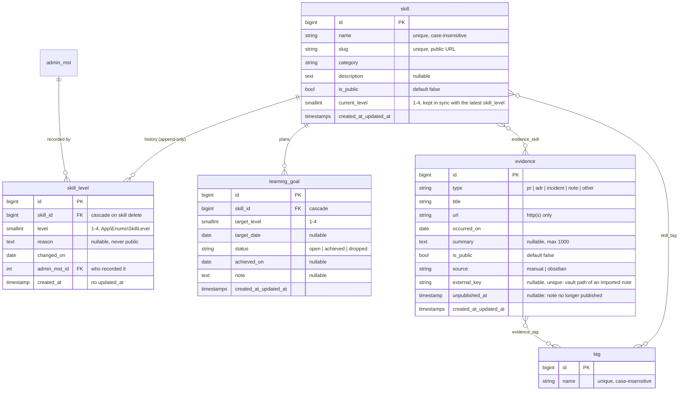
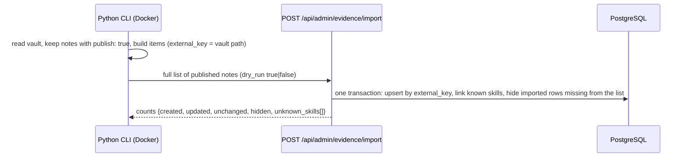

# RFC-002 — Skill Ledger

> 🇻🇳 Thiết kế Skill Ledger: mô hình dữ liệu, API admin và public, thứ tự triển khai theo lát, kế hoạch test. Dựa trên REQ-002.

| | |
|---|---|
| Status | Approved (TL, 2026-10-08 — the owner delegated design decisions; open questions §9 go to their ADRs) |
| Author | TL (owner, with Claude) |
| Reviewers | QA (acceptance criteria, P3-17), Ops (no new service), Security (public API) |
| Related | [REQ-002](../requirements/REQ-002-skill-ledger.md), [ADR-0004](../adr/0004-sanctum-spa-cookie-auth.md), [ADR-0005](../adr/0005-owner-viewer-roles.md), [ADR-0006](../adr/0006-audit-log.md), [ADR-0007](../adr/0007-remove-media-api.md); follow-ups: contract ADR (P3-03), search ADR (P3-04), Python ADR (P3-13) |

## 1. Summary

Add the Skill Ledger domain to the existing Laravel API: skills with an append-only level history, evidence links shared by several skills, tags, and learning goals that complete themselves. The admin SPA gets pages for them, `nextjs-docs` gets a public read-only skills page, and a Python CLI syncs published Obsidian notes through one idempotent import endpoint. Everything is additive (new tables, new routes), shipped in small slices; the unused media API and two unused framework tables are removed first.

> 🇻🇳 Thêm domain Skill Ledger vào API Laravel hiện có: kỹ năng có lịch sử cấp độ chỉ-thêm, bằng chứng dạng link dùng chung cho nhiều kỹ năng, tag, mục tiêu học tự hoàn thành. Admin có trang quản lý, `nextjs-docs` có trang public chỉ đọc, CLI Python đồng bộ note Obsidian qua một endpoint import idempotent. Toàn bộ là thêm mới, triển khai theo lát nhỏ; media API và hai bảng mặc định không dùng được xoá trước.

## 2. Problem, goals, non-goals

**Problem:** see REQ-002 §1 — no single, evidence-backed record of skills and their growth.

**Goals:** REQ-002 US-1 … US-7 with its non-functional requirements (p95 < 300 ms, nothing private on the public surface, every write audited, idempotent import).

**Non-goals:** file uploads; storing note bodies; public search; several users or ledgers; scheduled import; changes to auth or roles (ADR-0004 / ADR-0005 stay as they are); infrastructure changes (P4).

> 🇻🇳 Mục tiêu: các user story của REQ-002 và yêu cầu phi chức năng. Không làm: upload file, lưu nội dung note, tìm kiếm public, nhiều người dùng, import tự động, thay đổi auth/phân quyền, thay đổi hạ tầng.

## 3. Current state (`v2.0.0`)

- Tables: `admin_mst`, `audit_log`, `media_mgmt`, framework tables (`users`, `password_reset_tokens`, `sessions`, `cache*`, `jobs*`, `failed_jobs`, `migrations`), 12 in total. No views, no triggers.
- API: credential routes, `admin` CRUD, `audit-log/list`, the media API (26 files, ~2.2k lines incl. jobs, two console commands with a daily schedule and two Reverb events; no tests). No public API since RFC-001 slice 5.
- No screen calls the media API (RFC-001 §3 correction). `users` and `password_reset_tokens` are never read or written (`admin_mst` is the only account table). `sessions` **is** used while `SESSION_DRIVER=database` (PROGRESS owner item 10) and stays.
- OpenAPI is exported from code (`scramble:export`). The drift check was CI-only; since CI is paused (2026-10-08) `make verify` runs it (`make openapi-check`).

> 🇻🇳 Hiện trạng: 12 bảng, không view/trigger; media API không còn màn hình nào gọi; `users` và `password_reset_tokens` không được dùng; `sessions` vẫn dùng (driver `database`) nên giữ lại.

## 4. Proposed design

### 4.1 Module and naming

A new module scope **`Ledger`** next to `Master`, `Management` and `Audit`: controllers, requests, services, repositories, resources and tests under `…/Ledger/`. Table names are singular and without the old `_mst` / `_mgmt` suffixes (like `audit_log`), because the suffixes describe the CMS-era split that no longer exists. Services extend `AuditedCrudService`, so every admin write lands in `audit_log` with `auditable_type` = `skill`, `skill_level`, `evidence`, `tag` or `learning_goal`.

> 🇻🇳 Module mới `Ledger`. Tên bảng số ít, không hậu tố `_mst`/`_mgmt` (giống `audit_log`). Service kế thừa `AuditedCrudService` để mọi thao tác ghi đều vào audit log.

### 4.2 Data model (to-be `v2.1.0`)

Rules the model enforces:

| Rule | Where | REQ-002 |
|---|---|---|
| A skill is created with its first level; each level change appends a `skill_level` row and updates `skill.current_level` in the same transaction | `SkillLevelService` | US-1 |
| No update or delete route for `skill_level`; the repository has no update method; a test asserts both | API + test | US-1 |
| `skill.name`, `tag.name` unique ignoring case (unique index on `lower(name)`) | migration + FormRequest | US-1 |
| `evidence.url` must be `http`/`https` | FormRequest | US-2 |
| On a level change, every `open` goal of that skill with `target_level <= level` becomes `achieved` (`achieved_on` = `changed_on`); `dropped` goals are never touched | `SkillLevelService` | US-6 |
| Deleting a skill deletes its level history, goals and pivot rows (cascade); evidence and tags stay. The audit log keeps the deleted values | migration + service | – |
| The importer owns only `title`, `summary`, `occurred_on`, `url`, tags and skill links of `source = obsidian` rows; it never touches skills, levels, goals or manual evidence | import service | US-4 |

> 🇻🇳 Quy tắc chính: tạo kỹ năng kèm cấp độ đầu; mỗi lần đổi cấp thêm một dòng lịch sử và cập nhật `current_level` trong cùng transaction; không có route sửa/xoá lịch sử; tên không trùng (không phân biệt hoa thường); URL chỉ http(s); đổi cấp đạt mục tiêu thì mục tiêu `open` tự thành `achieved`; xoá kỹ năng xoá lịch sử, mục tiêu, liên kết; importer chỉ sở hữu vài trường của bằng chứng nguồn Obsidian.

`current_level` is stored, not computed: the public list and the dashboard read it for every skill, and keeping it in the same transaction as the history insert is one line of code. The history stays the source of truth (a test checks they agree).

### 4.3 API

Admin routes follow the existing shape (`GET x/list`, `POST x/store`, `PUT x/update/{id}`, `POST x/delete`) under `/api/admin`, owner writes / viewer reads (ADR-0005).

| Route | Purpose | Story |
|---|---|---|
| `skill/list`, `skill/store` (with `level`, `changed_on`, `reason`), `skill/update/{id}` (no level field), `skill/delete` | Skills; filters: category, tag, `is_public`, level | US-1 |
| `skill-level/list?skill_id=`, `skill-level/store` | Level history (read, append) | US-1, US-6 |
| `tag/list`, `tag/store`, `tag/update/{id}`, `tag/delete` | Tags | US-1 |
| `evidence/list`, `evidence/store`, `evidence/update/{id}`, `evidence/delete` | Evidence with `skill_ids`, `tag_ids`; filters: type, skill, source, `is_public` | US-2 |
| `learning-goal/list`, `learning-goal/store`, `learning-goal/update/{id}`, `learning-goal/delete` | Goals (dropping = update `status`) | US-6 |
| `search?q=` | One box over skills, goals, evidence, grouped by type (engine per the P3-04 ADR) | US-5 |
| `dashboard/summary` | Counts for the dashboard | US-7 |
| `evidence/import` | Idempotent sync of published notes (§4.5) | US-4 |

Public routes under `/api/public`, no auth, `throttle` per IP (60 / min), GET only, separate Resources that cannot reach private fields:

| Route | Returns |
|---|---|
| `GET /api/public/skills` | Public skills: name, slug, category, current level, tags |
| `GET /api/public/skills/{slug}` | One public skill + dates and levels of its history (no reasons) + its public, not unpublished evidence. Private or missing → 404 with the same body |

Error envelope, 401/403/404/422 and the audit rules are unchanged. Field-level contract: [ADR-0008](../adr/0008-code-first-openapi-contract.md#contract-details-for-the-skill-ledger-complements-rfc-002-43).

> 🇻🇳 API admin giữ đúng dạng route hiện có. API public nằm dưới `/api/public`, không cần đăng nhập, giới hạn 60 request/phút/IP, chỉ GET, dùng Resource riêng nên không thể lộ trường riêng tư; kỹ năng riêng tư và không tồn tại trả cùng một 404.

### 4.4 Frontends

- **Admin (`nextjs-fe`)**: pages Skills (list, detail with level timeline, goals and evidence), Evidence, Tags, Goals; a search box in the header; dashboard numbers from `dashboard/summary`. Forms with RHF + zod, types from the generated OpenAPI types.
- **Public (`nextjs-docs`)**: `/skills` and `/skills/[slug]`, server-rendered from the public API through nginx; the `/docs` "content moved" page stays. The docs app's production Docker stage cannot build today (`output: 'standalone'` and `public/` missing, PROGRESS 2026-10-07); it is fixed in the same slice, otherwise the Must story US-3 cannot be released.

> 🇻🇳 Admin: trang Kỹ năng, Bằng chứng, Tag, Mục tiêu, ô tìm kiếm, dashboard số thật. Public: `/skills` và `/skills/[slug]` render phía server; sửa luôn bước build production của app docs trong cùng lát vì US-3 là Must.

### 4.5 Importer

The CLI sends the **complete** set of published notes on every run, so the server can tell which imported rows disappeared (→ `is_public = false`, `unpublished_at = now`, never deleted) and idempotency is decided and tested in PHP, next to the data. An unchanged note is not written (no `updated_at` bump, no audit row), so a second run reports `0 created, 0 updated, 0 hidden`. A new note starts public (`publish: true` is the owner's intent); later runs never change `is_public` except to hide a removed note, so a choice made in the admin survives. A republished note clears `unpublished_at` but stays private until the owner makes it public again. How the CLI authenticates (the SPA session of ADR-0004 does not fit a CLI) is decided in the P3-13 ADR; the endpoint is owner-only either way.

> 🇻🇳 CLI gửi toàn bộ danh sách note đã publish mỗi lần chạy, server upsert theo `external_key` và ẩn (không xoá) các dòng đã import nhưng không còn trong danh sách. Note không đổi thì không ghi, nên lần chạy thứ hai báo 0 thay đổi. Note mới mặc định public; sau đó importer không bao giờ đổi `is_public` trừ khi ẩn note bị gỡ. Cách CLI xác thực quyết định ở ADR P3-13.

## 5. Alternatives considered

| Option | Pros | Cons | Why not |
|---|---|---|---|
| Level as a column on `skill`, history from `audit_log` | One table less | History mixed with every other audit row; reasons and `changed_on` (backdating) don't fit the audit shape; public page would read the audit log | History is a domain concept here, not an audit concern |
| `current_level` computed from history on read | No duplicated value | Subquery or window function on every list and on the public page | Stored value is updated in the same transaction; a test guards it |
| Evidence belongs to one skill (FK) | Simpler | Q4: one PR proves several skills → duplicates | Many-to-many |
| Tags as a JSON array column | No pivot tables | Filter and rename need JSON queries; no uniqueness | Two small pivots |
| Store note bodies and render them | Public page richer | Q6 says no; doubles the source of truth with Obsidian | Out of scope |
| Separate public service | Isolation | A second backend to run and deploy for two GET routes | Separate route group + Resources is enough; revisit if the public traffic grows |
| CLI calls the normal `evidence/store` / `update` per note | No new endpoint | Idempotency and "hide missing notes" logic lives in Python, far from the data; N requests; no single transaction | One sync endpoint |
| Soft delete (`is_delete`) for ledger tables | Matches `admin_mst` | Every query must filter; history and goals already cascade; the audit log keeps the values | Hard delete + audit log |

> 🇻🇳 Các phương án đã cân nhắc và lý do không chọn, xem bảng.

## 6. Rollout, migration, rollback

All new tables are additive, so no expand/contract step is needed; each slice is one or a few PRs and leaves the app working.

| # | Slice | Backlog | Rollback |
|---|---|---|---|
| 1 | Remove the media API (ADR-0007): controller, requests, service, `MinioService`, jobs, events, scheduled cleanup, routes, tests, baseline entries, OpenAPI; keep `media_mgmt` rows and MinIO objects. Drop `users` and `password_reset_tokens` (`down()` recreates them) | P3-05b | revert commit; `migrate:rollback --step=1` |
| 2 | Schema: migrations, models, enums (`SkillLevel`, `EvidenceType`, `EvidenceSource`, `GoalStatus`), factories, unit tests | P3-05 | `migrate:rollback` (tables are new and empty) |
| 3 | API: skills, tags, level history (+ goal auto-achieve hook) | P3-06 | revert |
| 4 | API: evidence, learning goals | P3-07 | revert |
| 5 | API: search + public routes (after the P3-04 ADR) | P3-08 | revert; search migration rollback if any |
| 6 | Contract tests | P3-09 | revert |
| 7 | Admin UI + dashboard | P3-10, P3-11 | revert |
| 8 | Public page + docs production build | P3-12 | revert |
| 9 | Import endpoint + Python CLI | P3-13, P3-14 | revert; imported rows can be removed by `source = obsidian` |
| 10 | E2E, k6 baseline, QA / PO acceptance, `v2.1.0` | P3-15 … P3-18 | – |

Upgrade from `v2.0.0`: one `migrate` (slice 1 drop + new tables). No data migration. Backup before deploy as usual (handbook 07). CD is paused, so deploys are manual.

> 🇻🇳 Mọi bảng đều mới nên không cần expand/contract. Mỗi lát có cách quay lui riêng (xem bảng). Nâng cấp từ `v2.0.0`: một lần `migrate`, không có migration dữ liệu; vẫn backup trước khi deploy.

## 7. Testing plan

| Level | Covers | Risk addressed |
|---|---|---|
| Unit (PHPUnit) | Enums, level/goal rules in services, import diffing (unchanged note → no write), slug generation | Wrong business rule |
| Feature / integration (PHPUnit, real PostgreSQL `testing` DB) | Every endpoint: happy path, 422, 401, 403 (viewer write), 404; append-only history; case-insensitive uniqueness; cascade on delete; audit rows; public API never returns private fields or private skills (asserted on the JSON keys, not only values); import run twice → zero changes; search without diacritics | Data leak, broken contract, non-idempotent import |
| Contract | Responses validated against the OpenAPI spec; FE types regenerated with no diff (P3-09, via `make verify`) | FE / BE drift |
| FE unit (Vitest) | Forms (zod rules), level timeline, search result grouping | UI regressions |
| Python (pytest) | Frontmatter parsing, summary rule (`summary` or first paragraph ≤ 300 chars), `publish: true` filter, dry-run | Wrong notes imported |
| E2E (Playwright, P3-15) | Login → create skill → add evidence → search finds it → public page shows it, private skill does not | The critical journey |
| Performance (k6, P3-16) | Search, admin lists, public endpoints at the REQ-002 volume (seeded) | NFR p95 < 300 ms |

> 🇻🇳 Kế hoạch test theo tầng và rủi ro mỗi tầng bảo vệ; điểm quan trọng nhất là test API public không bao giờ trả trường hoặc kỹ năng riêng tư, và import chạy hai lần không thay đổi gì.

## 8. Impact

- **Security:** first unauthenticated API since `v2.0.0`. Mitigations: GET only, rate limit, dedicated Resources, 404 for private, no admin data, tests on response keys. The import endpoint is owner-only. Evidence URLs are rendered as links with `rel="noopener noreferrer"`; `http(s)` only blocks `javascript:` URLs.
- **Performance:** small volume; indexes on `skill.slug`, `skill.is_public`, `evidence.external_key`, pivots; search index per the P3-04 ADR.
- **Operations:** no new container. Removing the media API leaves `ml-reverb` and `ml-queue` with no work (no job or broadcast left in the code) → removing them is a P4 (Docker hardening) item; MinIO stays for the stored objects.
- **Cost:** none.
- **Documentation:** `laravel-api/CLAUDE.md` (module list, public API, no media), `nextjs-fe/CLAUDE.md`, `nextjs-docs/CLAUDE.md`, a runbook for running the importer, release notes `v2.1.0`.

> 🇻🇳 Bảo mật: API public đầu tiên → chỉ GET, giới hạn tần suất, Resource riêng, test theo key JSON. Vận hành: không thêm container; sau khi bỏ media API thì `ml-reverb`, `ml-queue` không còn việc → xử lý ở P4. Tài liệu cần cập nhật: các CLAUDE.md, runbook importer, release notes.

## 9. Open questions

| # | Question | Decided in |
|---|---|---|
| 1 | OpenAPI-first spec or keep code-first export + contract tests? | **Decided:** [ADR-0008](../adr/0008-code-first-openapi-contract.md) — reviewed contract table, code-first spec, response validation |
| 2 | Postgres FTS with `unaccent` (needs an immutable wrapper function for an indexed column) vs `pg_trgm` vs both | **Decided:** [ADR-0009](../adr/0009-postgres-search.md) — full-text on unaccented generated column, trigram fallback |
| 3 | How the CLI authenticates (Sanctum personal access token with an `import` ability vs a static token) | P3-13 ADR |
| 4 | Fixed list of categories or free text? Proposal: free text (≤ 50 chars) with suggestions from existing values; change later if it gets messy | P3-05 (default: free text) |

> 🇻🇳 Câu hỏi mở: kiểu hợp đồng OpenAPI (P3-03), công nghệ tìm kiếm (P3-04), cách CLI xác thực (P3-13), danh mục cố định hay tự do (mặc định: tự do).
