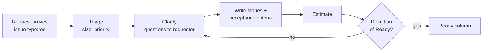

# 02 — Work intake: from request to "Ready"

> 🇻🇳 Tiếp nhận công việc: từ yêu cầu tới trạng thái "sẵn sàng làm".

Most rework comes from starting work that was not understood. Intake turns a vague wish into something a developer can build and QA can verify.

> 🇻🇳 Phần lớn việc làm lại xuất phát từ việc bắt tay làm khi chưa hiểu yêu cầu. Bước tiếp nhận biến một mong muốn mơ hồ thành thứ dev xây được và QA kiểm chứng được.

## Flow



1. **Arrive.** Every request is an issue (`type:req`, or `type:bug`). Requests in chat or in a call are copied into an issue by whoever received them.
   > 🇻🇳 Mọi yêu cầu đều thành issue. Yêu cầu nhận qua chat/cuộc gọi thì người nhận chép lại thành issue.
2. **Triage** (within 1 working day): is it a duplicate? which size (small / normal / large, see the [handbook README](README.md#two-speeds))? first priority guess.
   > 🇻🇳 Phân loại trong 1 ngày làm việc: trùng không? quy mô? ưu tiên sơ bộ?
3. **Clarify** with the question bank below. Ask all questions in one comment, numbered, so answers can refer to numbers. Record answers in the issue, never only in chat.
   > 🇻🇳 Làm rõ bằng bộ câu hỏi dưới đây. Hỏi gộp trong một comment, đánh số. Câu trả lời phải ghi vào issue.
4. **Write user stories and acceptance criteria** (format below).
5. **Estimate** in sessions (1 session ≈ 2 hours). Anything over 6 sessions is split.
   > 🇻🇳 Ước lượng theo buổi (1 buổi ≈ 2 giờ). Việc lớn hơn 6 buổi thì tách nhỏ.
6. **Check the Definition of Ready**, then move to `Ready`.

## Question bank

> 🇻🇳 Bộ câu hỏi làm rõ yêu cầu. Không cần hỏi hết; chọn những câu mà câu trả lời còn chưa rõ.

| Topic | Questions |
|---|---|
| Goal | What problem does this solve? For whom? What happens if we do nothing? How will we know it worked (metric)? |
| Users | Who uses it (role, permissions)? How often? On which device? |
| Scope | What is explicitly *out* of scope? Is there a smaller first version that is still useful? |
| Behaviour | What is the main flow step by step? What should happen on error / empty data / no permission? |
| Data | Which data is created, read, changed, deleted? Where does it come from? Retention? Personal data? |
| Rules | Validation rules, limits, formats, time zones, rounding? |
| Integration | Which other systems or APIs are involved? Who owns them? |
| Non-functional | Expected volume, response time, availability? Security or audit needs? |
| Priority | Deadline and why? What else should move if this comes first? |
| Acceptance | Who accepts it? How (demo, test data, checklist)? |

**Feedback rule.** When you answer a request with a counter-proposal, give options with trade-offs and a recommendation ("A is faster, B scales better; I recommend A because…"), never just "this is hard".

> 🇻🇳 **Nguyên tắc phản hồi.** Khi phản hồi bằng đề xuất khác, đưa ra các phương án kèm đánh đổi và đề xuất của mình, không chỉ nói "cái này khó".

## User stories and acceptance criteria

> 🇻🇳 User story và tiêu chí chấp nhận.

```text
As a <role>, I want <capability>, so that <benefit>.

Acceptance criteria
  Scenario: <name>
    Given <state>
    When  <action>
    Then  <observable result>
```

Good acceptance criteria are observable (a tester can check them without reading code), cover the main error cases, and contain concrete examples (values, limits).

> 🇻🇳 Tiêu chí chấp nhận tốt thì quan sát được (tester kiểm được mà không đọc code), bao gồm các trường hợp lỗi chính và có ví dụ cụ thể.

## Definition of Ready (DoR)

> 🇻🇳 Định nghĩa "Sẵn sàng". Một việc chỉ được kéo vào `Doing` khi thoả mãn hết.

- [ ] Problem and goal are stated.
- [ ] Out-of-scope is stated.
- [ ] Acceptance criteria exist and QA agrees they are testable.
- [ ] Open questions are answered or explicitly parked.
- [ ] Dependencies (other tasks, data, access) are available.
- [ ] Estimate ≤ 6 sessions (otherwise split).
- [ ] For large changes: an RFC is planned or approved.

## Prioritisation

> 🇻🇳 Sắp xếp ưu tiên.

- Priority labels `prio:p1` (now) … `prio:p4` (someday).
- Within a phase, use **MoSCoW** (Must / Should / Could / Won't this phase).
- When comparing many ideas, score **RICE** = Reach × Impact × Confidence ÷ Effort and write the numbers in the issue, so the reasoning can be challenged later.

> 🇻🇳 Trong một giai đoạn dùng MoSCoW. Khi so sánh nhiều ý tưởng thì chấm điểm RICE và ghi số vào issue để sau này còn xem lại lý do.
