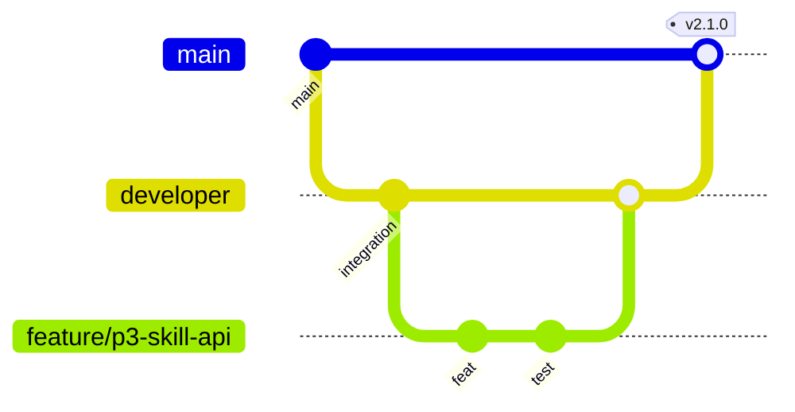

# 04 — Git, pull requests and code review

> 🇻🇳 Git, pull request và review code.

## Branch model

> 🇻🇳 Mô hình branch.



| Branch | Purpose | Lifetime | Protected | Deploys to |
|---|---|---|---|---|
| `main` | Released code; every merge is a release candidate | Permanent | Yes: PR only, CI required, no force push, no delete | prod-like (from P5) |
| `developer` | Integration of finished work | Permanent | Yes: same rules | staging (`cd.yml`) |
| `feature/*` | New functionality | Days; deleted after merge | No | – |
| `refactor/*` | Internal change without new behaviour | Days | No | – |
| `fix/*` | Bug fix through the normal flow | Hours–days | No | – |
| `hotfix/*` | Urgent production fix, branched from `main`, merged to `main` **and** `developer` | Hours | No | – |
| `chore/*`, `docs/*`, `test/*` | Tooling, documentation, tests only | Days | No | – |

Naming: `<type>/<phase-or-issue>-<short-slug>`, e.g. `feature/p3-skill-api`, `fix/142-upload-timeout`.

Merged work branches are deleted automatically by `.github/workflows/cleanup-branch.yml` (it never touches `main`, `developer`, `staging`). Locally: `git fetch --prune` and `git branch -d <branch>`.

> 🇻🇳 Branch làm việc đã merge được workflow tự xoá trên GitHub; ở local dùng `git fetch --prune` và `git branch -d`. Branch tồn tại càng ngắn càng ít xung đột.

## Commits

> 🇻🇳 Commit — theo Conventional Commits.

```text
<type>(<scope>): <imperative summary, ≤ 72 chars>

<body: why, not what — wrap at 72>

Refs: REQ-002, #123
```

| Type | Use |
|---|---|
| `feat` | New behaviour for the user |
| `fix` | Bug fix |
| `refactor` | Code change without behaviour change |
| `perf` | Performance improvement |
| `test` | Tests only |
| `docs` | Documentation only |
| `build` / `ci` / `chore` | Build, pipeline, tooling |

Scopes: `api`, `fe`, `docs-site`, `docker`, `ci`, `infra`, `tools`. Breaking change: `feat(api)!: …` plus a `BREAKING CHANGE:` line in the body.

Rules: one purpose per commit; the build passes on every commit; no AI attribution trailers; never commit secrets, dumps or `.env` files. Stage files by explicit path (`git add path/to/file`), not whole folders, and read `git status` before committing (retro P0–P1). Read `git diff --cached --stat` right before `git commit`: files staged earlier for another commit ride along otherwise (retro P2).

> 🇻🇳 Mỗi commit một mục đích; commit nào cũng build được; không có trailer AI; không commit secret, dump, `.env`. Add file theo đường dẫn cụ thể, không add cả thư mục, và đọc `git status` trước khi commit; ngay trước `git commit` xem `git diff --cached --stat` để không kéo theo file đã stage cho commit khác.

## Daily git routine

> 🇻🇳 Thao tác git hằng ngày.

```bash
git switch developer && git pull --ff-only          # start from the latest integration branch
git switch -c feature/p3-skill-api                   # one branch per task
# … work, commit small steps …
git fetch origin && git rebase origin/developer      # keep up to date (only while the branch is yours alone)
git push -u origin feature/p3-skill-api              # open a PR
```

## Pull requests

> 🇻🇳 Pull request.

- **Size:** aim for < 400 changed lines (excluding generated files). Bigger work is split into stacked PRs.
- **Description:** the PR template (`.github/pull_request_template.md`): what, why, how tested, screenshots, risks, rollback.
- **Draft early** to show direction; mark ready when CI is green and the checklist is done.
- **Merge:** "Create a merge commit" into `developer` and `main` (keeps the branch history and tags valid). Delete the branch after merge.

> 🇻🇳 PR nên dưới 400 dòng thay đổi; mô tả theo template; mở draft sớm; merge bằng merge commit.

## Code review checklist

> 🇻🇳 Checklist review code.

| Area | Check |
|---|---|
| Correctness | Does it do what the acceptance criteria say? Edge cases, errors, empty states? |
| Design | Right layer (controller / service / repository)? Duplication? Simpler option? |
| Contract | API change reflected in OpenAPI, FE types and the docs site? Backward compatible? |
| Data | Migration reversible or expand/contract? Indexes? N+1? |
| Security | Authorisation on every endpoint, validated input, no secrets, no sensitive data in logs |
| Tests | Behaviour covered at the right level; tests fail without the change |
| Operability | Logs useful, errors clear, config via `config()`, feature flag if risky |
| Readability | Names, no magic values, comments explain *why* |

Reviewer etiquette: comment on the code, not the person; prefix optional remarks with `nit:`; approve when remaining comments are nits. Author: answer every comment (fix or explain), do not resolve the reviewer's threads yourself when the point is disputed.

> 🇻🇳 Góp ý vào code, không vào người; nhận xét không bắt buộc ghi `nit:`. Tác giả trả lời mọi comment (sửa hoặc giải thích).

## Resolving conflicts

> 🇻🇳 Xử lý xung đột.

1. Update first: `git fetch origin && git rebase origin/developer` (or `git merge origin/developer` if the branch is shared).
2. For each conflicted file, understand **both** sides — read the other commit (`git log -p origin/developer -- <file>`) before choosing.
3. Generated files (`pnpm-lock.yaml`, `openapi.json`, `openapi.d.ts`): never hand-merge; take one side and regenerate (`pnpm install`, `make openapi`).
4. Run the tests for the touched area, then `git rebase --continue`.
5. If the conflict is about behaviour (two people changed the same rule), stop and ask the other author/TL.

> 🇻🇳 Hiểu cả hai phía trước khi chọn; file sinh tự động thì không sửa tay mà sinh lại; xung đột về hành vi thì hỏi người kia hoặc TL.

## Parallel work with several AI sessions

> 🇻🇳 Làm song song với nhiều phiên AI trên cùng một branch và một thư mục làm việc.

Since 2026-10-08 several Claude conversations work at the same time on **one branch and one working tree** (no worktree per session: the Docker stack bind-mounts this directory). What keeps them apart is a board of **lanes**: [.claude/lab/BOARD.md](../../.claude/lab/BOARD.md), driven by `scripts/lane.sh`; the rules are in [.claude/rules/parallel-lanes.md](../../.claude/rules/parallel-lanes.md) and a session starts with the `/lane` skill.

> 🇻🇳 Từ 2026-10-08 nhiều conversation Claude làm cùng lúc trên một branch và một thư mục (không dùng worktree riêng vì stack Docker mount chính thư mục này). Thứ giữ chúng không giẫm chân nhau là bảng **lane** trong `BOARD.md`, điều khiển bằng `scripts/lane.sh`; bắt đầu bằng skill `/lane`.

**Lanes own paths.** Each lane (api, fe, public, importer, perf, infra, docs, release) lists the folders it owns and runs one task at a time. A session edits only its lane's paths plus the records its task names. Files nobody owns (`Makefile`, `docker/docker-compose.yml`, `.gitignore`, `package.json`, `pnpm-lock.yaml`, `CLAUDE.md`, `docs/plan/*`, the PROGRESS file outside its log) are edited under a lock, in a few minutes.

**Lifecycle of a task:**

| Step | Command | What it does |
|---|---|---|
| Pick | `scripts/lane.sh status` / `next [lane]` | Busy and free lanes, tasks whose dependencies are done |
| Claim | `scripts/lane.sh claim <id>` | `todo` → `doing`; fails if taken, if the lane is busy or a dependency is open |
| Shared file | `lock <path>` → edit → `commit` → `unlock <path>` | Exclusive edit of an unowned file |
| Check | `scripts/lane.sh run make test f=…` / `run make verify` | Docker-backed checks one lane at a time (shared `testing` DB, CPU) |
| Commit | `scripts/lane.sh commit "<msg>" <paths…>` | Stages and commits only those paths, under a git lock |
| Finish | `scripts/lane.sh done <id> "<sha> — result"` | Board → `done`, mirrors the backlog row, appends the PROGRESS log, commits those three files |
| Stuck / new work | `block <id> "<reason>"` / `add <lane> <id> …` | Frees the lane / puts the work in the lane that owns the code |

Never use `git add -A` / `.` / `-u`, `commit -a`, `stash`, `restore`, `checkout -- .`, `reset --hard`, `clean`, rebase, amend or a branch switch: each of them touches another session's uncommitted work. Uncommitted changes you did not make belong to someone else — don't format, stage or revert them, even when they break your build; say so in your task note.

> 🇻🇳 Vòng đời task: `claim` → làm trong path của lane → kiểm tra qua `run` → `commit` theo path → `done`. File không ai sở hữu thì `lock` / `commit` / `unlock`. Cấm các lệnh git đụng toàn bộ thư mục (`add -A`, `commit -a`, `stash`, `restore`, `reset --hard`, `clean`, rebase, amend, đổi branch). Thay đổi chưa commit không phải của mình thì không đụng vào, chỉ ghi chú lại.

**Lessons from the first day:**

- **The stack sees the working tree, not the commits.** A perf run once measured another lane's uncommitted config change. Before timing or testing something that others may be editing, check `git status -- <area>` and say what was in the tree; measure committed code for numbers that go into a report.
- **Shared runtime resources need the same care as files.** Two sessions started their own `php -S` on the same port inside `ml-php`; the perf scripts now refuse a taken port (`PERF_PORT` overrides). The same holds for database names, buckets and Docker image tags: prefix them with the lane or task.
- **`make verify` may fail on someone else's half-done work.** Run your area's checks; report a foreign failure instead of fixing it.
- **Data changes on shared stores are decisions.** Seeding accounts on the dev DB or restoring over it is the owner's call; use throwaway databases (`perf`, `restore_check`) for anything that writes.
- **Status lives in one place.** The board is the source of truth for who does what; the backlog and the PROGRESS log are written by `lane.sh`, never by hand, so two sessions never edit the same status line.
- **An interface others call has consumers in other lanes** (retro P3, BUG-01). Changing a port, a host name, an environment variable or a route includes a search for its users across the whole repository (`git grep ml-nginx`, `git grep LEDGER_API_URL`), listed in the task note. Consumers in your lane change in the same commit; consumers in another lane get a `lane.sh add` task in the same session. P4-02 moved nginx to port 8080 and the importer kept calling port 80 until QA tried it.

> 🇻🇳 Bài học ngày đầu: (1) stack chạy trên thư mục làm việc chứ không phải commit — trước khi đo hay test, xem `git status` khu vực đó, số liệu báo cáo phải đo trên code đã commit; (2) tài nguyên chạy chung (cổng, tên DB, bucket, tag image) cũng cần tránh trùng như file; (3) `make verify` có thể đỏ vì việc dở của lane khác — báo lại, không tự sửa; (4) ghi dữ liệu lên kho dùng chung (DB dev) là quyết định của owner — dùng DB tạm; (5) trạng thái chỉ nằm ở board, backlog và PROGRESS do `lane.sh` ghi; (6) đổi một giao diện mà nơi khác gọi tới (cổng, host, biến môi trường, route) thì phải tìm mọi chỗ dùng nó trong cả repo, ghi vào task note; chỗ dùng thuộc lane khác thì `lane.sh add` ngay (bài học BUG-01).
