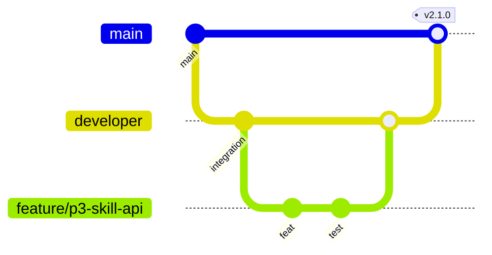

# 04 — Git, pull requests and code review

> 🇻🇳 Git, pull request và review code.

## Branch model

> 🇻🇳 Mô hình branch.



| Branch | Purpose | Lifetime | Protected | Deploys to |
|---|---|---|---|---|
| `main` | Released code; every merge is a release candidate | Permanent | Yes: PR only, CI required, no force push, no delete | prod-like (from P5) |
| `developer` | Integration of finished work | Permanent | Yes: same rules | staging (`cd.yml`) |
| `feature/*` | New functionality | Days; deleted after merge | No | – |
| `refactor/*` | Internal change without new behaviour | Days | No | – |
| `fix/*` | Bug fix through the normal flow | Hours–days | No | – |
| `hotfix/*` | Urgent production fix, branched from `main`, merged to `main` **and** `developer` | Hours | No | – |
| `chore/*`, `docs/*`, `test/*` | Tooling, documentation, tests only | Days | No | – |

Naming: `<type>/<phase-or-issue>-<short-slug>`, e.g. `feature/p3-skill-api`, `fix/142-upload-timeout`.

Merged work branches are deleted automatically by `.github/workflows/cleanup-branch.yml` (it never touches `main`, `developer`, `staging`). Locally: `git fetch --prune` and `git branch -d <branch>`.

> 🇻🇳 Branch làm việc đã merge được workflow tự xoá trên GitHub; ở local dùng `git fetch --prune` và `git branch -d`. Branch tồn tại càng ngắn càng ít xung đột.

## Commits

> 🇻🇳 Commit — theo Conventional Commits.

```text
<type>(<scope>): <imperative summary, ≤ 72 chars>

<body: why, not what — wrap at 72>

Refs: REQ-002, #123
```

| Type | Use |
|---|---|
| `feat` | New behaviour for the user |
| `fix` | Bug fix |
| `refactor` | Code change without behaviour change |
| `perf` | Performance improvement |
| `test` | Tests only |
| `docs` | Documentation only |
| `build` / `ci` / `chore` | Build, pipeline, tooling |

Scopes: `api`, `fe`, `docs-site`, `docker`, `ci`, `infra`, `tools`. Breaking change: `feat(api)!: …` plus a `BREAKING CHANGE:` line in the body.

Rules: one purpose per commit; the build passes on every commit; no AI attribution trailers; never commit secrets, dumps or `.env` files.

> 🇻🇳 Mỗi commit một mục đích; commit nào cũng build được; không có trailer AI; không commit secret, dump, `.env`.

## Daily git routine

> 🇻🇳 Thao tác git hằng ngày.

```bash
git switch developer && git pull --ff-only          # start from the latest integration branch
git switch -c feature/p3-skill-api                   # one branch per task
# … work, commit small steps …
git fetch origin && git rebase origin/developer      # keep up to date (only while the branch is yours alone)
git push -u origin feature/p3-skill-api              # open a PR
```

## Pull requests

> 🇻🇳 Pull request.

- **Size:** aim for < 400 changed lines (excluding generated files). Bigger work is split into stacked PRs.
- **Description:** the PR template (`.github/pull_request_template.md`): what, why, how tested, screenshots, risks, rollback.
- **Draft early** to show direction; mark ready when CI is green and the checklist is done.
- **Merge:** "Create a merge commit" into `developer` and `main` (keeps the branch history and tags valid). Delete the branch after merge.

> 🇻🇳 PR nên dưới 400 dòng thay đổi; mô tả theo template; mở draft sớm; merge bằng merge commit.

## Code review checklist

> 🇻🇳 Checklist review code.

| Area | Check |
|---|---|
| Correctness | Does it do what the acceptance criteria say? Edge cases, errors, empty states? |
| Design | Right layer (controller / service / repository)? Duplication? Simpler option? |
| Contract | API change reflected in OpenAPI, FE types and the docs site? Backward compatible? |
| Data | Migration reversible or expand/contract? Indexes? N+1? |
| Security | Authorisation on every endpoint, validated input, no secrets, no sensitive data in logs |
| Tests | Behaviour covered at the right level; tests fail without the change |
| Operability | Logs useful, errors clear, config via `config()`, feature flag if risky |
| Readability | Names, no magic values, comments explain *why* |

Reviewer etiquette: comment on the code, not the person; prefix optional remarks with `nit:`; approve when remaining comments are nits. Author: answer every comment (fix or explain), do not resolve the reviewer's threads yourself when the point is disputed.

> 🇻🇳 Góp ý vào code, không vào người; nhận xét không bắt buộc ghi `nit:`. Tác giả trả lời mọi comment (sửa hoặc giải thích).

## Resolving conflicts

> 🇻🇳 Xử lý xung đột.

1. Update first: `git fetch origin && git rebase origin/developer` (or `git merge origin/developer` if the branch is shared).
2. For each conflicted file, understand **both** sides — read the other commit (`git log -p origin/developer -- <file>`) before choosing.
3. Generated files (`pnpm-lock.yaml`, `openapi.json`, `openapi.d.ts`): never hand-merge; take one side and regenerate (`pnpm install`, `make openapi`).
4. Run the tests for the touched area, then `git rebase --continue`.
5. If the conflict is about behaviour (two people changed the same rule), stop and ask the other author/TL.

> 🇻🇳 Hiểu cả hai phía trước khi chọn; file sinh tự động thì không sửa tay mà sinh lại; xung đột về hành vi thì hỏi người kia hoặc TL.
