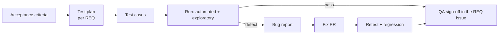

# 06 — Testing and QA

> 🇻🇳 Kiểm thử và QA.

## Test by risk, not by percentage

> 🇻🇳 Test theo rủi ro, không chạy theo phần trăm coverage.

Ask "what would hurt most if it broke, and what is the cheapest test that would catch it?" Coverage gates (backend suite, FE 80/80/75/65) only stop coverage from silently dropping; they are not the goal.

> 🇻🇳 Hãy hỏi "cái gì hỏng thì đau nhất, và test rẻ nhất nào bắt được nó?". Ngưỡng coverage chỉ để coverage không âm thầm giảm, không phải mục tiêu.

| Level | What it proves | Where here | Speed | Write it when |
|---|---|---|---|---|
| **Unit** | A function/class follows its rules | `laravel-api/tests/Unit`, Vitest specs | ms | Business rules, parsing, calculations, hooks |
| **Integration / feature** | Components work together with real DB/Redis | `laravel-api/tests/Feature` (HTTP + DB) | 100 ms | Every endpoint: happy path, 422, 401/403, 404 |
| **Contract** | FE and API agree on shapes | OpenAPI → generated TS types; CI fails if `openapi.json` is stale | s | Any API change |
| **E2E / system** | A real user journey works in a browser | Playwright, `e2e/` (`make e2e`) | s–min | Only critical journeys (login, core flow) |
| **Performance** | Latency/throughput under load | k6 (from P3/P8) | min | Before release of heavy endpoints; after optimisations |
| **Security** | Known attack classes are blocked | Feature tests for authz, ZAP baseline (P8) | min | Auth, input handling, file upload |

The pyramid: many unit and feature tests, few E2E tests, performance and security tests at release points.

> 🇻🇳 Kim tự tháp: nhiều unit/feature test, ít E2E, test hiệu năng và bảo mật ở các mốc release.

**Tests never touch dev data.** Feature tests use their own database (`testing`) and their own Redis DBs (14/15), forced in `phpunit.xml` with `<server force="true">` because container environment variables win over `<env>`. `TestEnvironmentTest` fails the suite if this ever breaks. Any new store (queue, search index, bucket) gets the same isolation and a guard test before the first test writes to it ([PRB-002](../problems/PRB-002-tests-used-dev-database.md), retro P2).

> 🇻🇳 **Test không bao giờ chạm dữ liệu dev.** Test dùng DB `testing` và Redis DB 14/15 riêng, ép bằng `<server force="true">` trong `phpunit.xml`; `TestEnvironmentTest` làm suite fail nếu cô lập bị hỏng. Kho lưu trữ mới nào (queue, search index, bucket) cũng phải được cô lập và có test canh gác trước khi test đầu tiên ghi vào.

**The one exception is the E2E journey** (`make e2e`, P3-15): it drives the running stack in a browser, and that stack has only the dev database. It runs Playwright in its own container on the Compose network (the browser maps `localhost:81` to nginx so cookies and CSRF see the real origin) and keeps its footprint reversible: a dedicated owner `e2e_owner` with a fresh random password per run, disabled afterwards; every record named `E2E <run id>`; the records and that account's `audit_log` rows deleted at the end, also after a failure or an interrupted run. Run it through `scripts/lane.sh run make e2e`. A failed run leaves its report, screenshot and trace in `e2e/artifacts/`.

> 🇻🇳 **Ngoại lệ duy nhất là E2E** (`make e2e`, P3-15): nó điều khiển stack đang chạy qua trình duyệt, mà stack đó chỉ có DB dev. Playwright chạy trong container riêng trên mạng Compose (trình duyệt map `localhost:81` sang nginx để cookie/CSRF thấy đúng origin) và chỉ để lại dấu vết có thể xóa: tài khoản owner riêng `e2e_owner` với mật khẩu ngẫu nhiên mỗi lần, bị vô hiệu hóa sau khi chạy; mọi bản ghi tên `E2E <run id>`; bản ghi và các dòng `audit_log` của tài khoản đó bị xóa khi kết thúc, kể cả khi fail hay bị ngắt giữa chừng. Chạy qua `scripts/lane.sh run make e2e`; lần chạy fail để lại report, ảnh chụp và trace trong `e2e/artifacts/`.

## Definition of Done (DoD)

> 🇻🇳 Định nghĩa "Hoàn thành". Chưa đạt hết thì chưa phải xong.

- [ ] Acceptance criteria met and demonstrated.
- [ ] Tests at the right level added; they fail without the change.
- [ ] `make verify` green locally and in CI.
- [ ] API change → OpenAPI and FE types regenerated; docs site updated if affected.
- [ ] Migration has a working `down()` or an expand/contract plan.
- [ ] Docs updated (handbook, runbook, ADR, README) where behaviour or operations changed.
- [ ] Release-notes line written in the PR.
- [ ] No new warnings, no TODO without an issue link.

## QA flow

> 🇻🇳 Quy trình QA.

1. **Test plan** (for normal/large changes): scope, environments, test data, what is automated vs manual, entry/exit criteria. A few lines in the REQ issue are enough for normal changes.
2. **Test cases** come from the acceptance criteria; each Given/When/Then becomes at least one automated test.
3. **Exploratory testing**: 30-minute time box, a charter ("explore upload with large and corrupt files"), notes of what was tried.
4. **Sign-off**: QA comments "QA passed" with the environment and commit tested.

> 🇻🇳 Kế hoạch test → test case từ tiêu chí chấp nhận → test thăm dò có giới hạn thời gian → QA xác nhận kèm môi trường và commit đã test.

## Bug reports

> 🇻🇳 Báo lỗi — dùng issue form "Bug".

A good bug report lets someone else reproduce the bug in under 5 minutes: title = symptom + where; environment + version/commit; exact steps; expected vs actual; evidence (screenshot, log line, request ID); severity.

> 🇻🇳 Báo lỗi tốt giúp người khác tái hiện trong 5 phút: tiêu đề nêu triệu chứng và vị trí, môi trường + phiên bản, các bước chính xác, kết quả mong đợi và thực tế, bằng chứng, mức độ nghiêm trọng.

### Severity vs priority

Severity is the *impact* (set by QA); priority is the *order of work* (set by PO). A typo on the home page is low severity but may be high priority before a demo.

> 🇻🇳 Severity là *mức ảnh hưởng* (QA đặt); priority là *thứ tự xử lý* (PO đặt). Lỗi chính tả ở trang chủ có severity thấp nhưng priority có thể cao trước buổi demo.

| Severity | Meaning | Example |
|---|---|---|
| S1 Critical | Data loss, security breach, system unusable | Login impossible; data deleted |
| S2 Major | Main feature broken, no workaround | Cannot save a skill |
| S3 Minor | Feature works with a workaround or partially | Sort order wrong |
| S4 Trivial | Cosmetic | Misaligned icon |

## Test data

Tests create their own data with factories; no test depends on another test or on dev data. See [10-docs-and-data.md](10-docs-and-data.md#data-rules).

> 🇻🇳 Test tự tạo dữ liệu bằng factory; không test nào phụ thuộc test khác hay dữ liệu dev.
