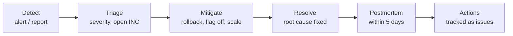

# 08 — Operations and incidents

> 🇻🇳 Vận hành và xử lý sự cố.

## Monitoring basics

> 🇻🇳 Giám sát cơ bản. Công cụ cụ thể được dựng ở Phase 6; nguyên tắc áp dụng ngay.

| Signal | Answers | Examples |
|---|---|---|
| **Metrics** | Is something wrong, how much? | Request rate, error rate, p95 latency (RED); CPU, memory, disk, connections (USE) |
| **Logs** | What exactly happened? | Exception with `request_id`, failed job, slow query |
| **Traces** | Where did the time go across services? | nginx → API → Postgres → queue |
| **Health checks** | Is the service alive and ready? | `/health`, container `HEALTHCHECK` |

Alert on **symptoms users feel** (errors, latency, availability), not on every cause. Every alert must link to a runbook; an alert nobody acts on is deleted.

> 🇻🇳 Cảnh báo theo **triệu chứng người dùng cảm nhận**, không theo mọi nguyên nhân. Mỗi cảnh báo phải có runbook; cảnh báo không ai xử lý thì xoá.

## Incident severity

> 🇻🇳 Mức độ sự cố.

| Level | Definition | Response |
|---|---|---|
| **SEV-1** | System down, data loss or security breach | Drop everything; incident commander; status update every 30 min |
| **SEV-2** | Core feature broken or badly degraded for most users | Start within 30 min; updates every hour |
| **SEV-3** | Partial degradation, workaround exists | Next working session |
| **SEV-4** | Minor issue, no user impact yet | Normal backlog |

## Incident flow

> 🇻🇳 Quy trình xử lý sự cố.



1. **Detect** — alert, user report, or failed check.
2. **Triage** — set severity, open an `INC-xxx` issue (`type:incident`), name the **incident commander** (coordinates, does not debug) and the **investigator(s)**.
3. **Mitigate first** — restore service before finding the root cause: roll back, disable a flag, restart, scale, fail over.
4. **Communicate** — short status notes in the issue: what users see, what we are doing, next update time.
5. **Investigate** — use the method below; write a timeline as you go (times + what you saw/did).
6. **Resolve** — fix the cause or confirm the mitigation is a safe permanent state.
7. **Postmortem** — [template](../templates/postmortem.md), within 5 working days for SEV-1/2.

> 🇻🇳 Phát hiện → phân loại và mở INC, cử người chỉ huy → **khắc phục tạm trước** → thông báo trạng thái → điều tra (ghi timeline) → giải quyết dứt điểm → postmortem trong 5 ngày.

## How to investigate

> 🇻🇳 Cách điều tra sự cố.

1. **Scope**: what is broken, for whom, since when? What changed around that time (deploys, config, data, traffic)? `git log --since`, deploy history.
2. **Follow the request**: browser network tab → nginx access/error log → API log (`request_id`) → DB / Redis / queue → external service.
3. **Check the usual suspects** in order: recent deploy → configuration/secrets → resource limits (disk, memory, connections) → dependencies (DB, Redis, MinIO) → data (bad row, migration) → load.
4. **Form one hypothesis at a time**, test it, write the result in the timeline. Change one thing at a time.
5. **Preserve evidence** (logs, screenshots, query output) before restarting things.

> 🇻🇳 Xác định phạm vi và "cái gì vừa thay đổi"; lần theo request qua từng lớp; kiểm tra nghi phạm quen thuộc theo thứ tự; mỗi lần một giả thuyết; giữ lại bằng chứng trước khi khởi động lại.

Useful commands today:

```bash
make ps                       # container health
make logs s=ml-php            # API logs (also ml-nginx, ml-postgres, ml-nextjs …)
docker stats --no-stream      # CPU / memory per container
docker exec ml-postgres sh -c 'psql -U "$POSTGRES_USER" -d "$POSTGRES_DB" -c "select state, count(*) from pg_stat_activity group by 1"' 
df -h && docker system df     # disk
```

## Postmortem rules

> 🇻🇳 Quy tắc postmortem.

- **Blameless**: describe what the system and process allowed, not who made a mistake. "The deploy script did not check migrations" instead of "X forgot".
- Include a timeline, impact (duration, users, data), root cause (5 whys), what went well, what went badly, where we got lucky.
- Every action item is an issue with an owner and a due phase; the postmortem is closed when the actions are done.

> 🇻🇳 **Không đổ lỗi**: mô tả hệ thống và quy trình đã cho phép lỗi xảy ra thế nào, không phải ai sai. Mỗi hành động khắc phục là một issue có người phụ trách.

## Runbooks

A runbook is the step-by-step answer to one alert or one routine operation (restore a backup, rotate a secret, add disk). Location: `docs/runbooks/`. Format: when to use · preconditions · steps (copy-pasteable commands) · how to verify · how to roll back.

> 🇻🇳 Runbook là các bước cụ thể cho một cảnh báo hoặc một thao tác định kỳ. Định dạng: khi nào dùng · điều kiện trước · các bước (lệnh copy được) · cách kiểm tra · cách quay lui.
