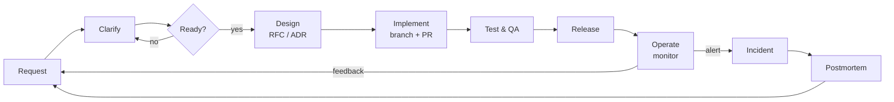

# Handbook — how this team works

> 🇻🇳 Sổ tay làm việc — team này làm việc như thế nào.

This handbook is the operating model of a small product team. Here the "team" is one person playing every role, helped by AI-simulated stakeholders, but every rule is written so a real team of 3–8 people could adopt it unchanged.

> 🇻🇳 Đây là mô hình vận hành của một team sản phẩm nhỏ. Ở đây "team" là một người đóng mọi vai, có AI giả lập các bên liên quan, nhưng mọi quy tắc đều viết sao cho một team thật 3–8 người dùng được ngay.

## The lifecycle in one picture

> 🇻🇳 Vòng đời công việc trong một hình.

| Step | Chapter | Main output |
|---|---|---|
| Who does what | [01-team.md](01-team.md) | RACI |
| Request → Ready | [02-intake.md](02-intake.md) | `REQ-xxx` with acceptance criteria |
| Design | [03-design.md](03-design.md) | RFC, ADR, diagrams |
| Code & review | [04-git.md](04-git.md), [05-coding.md](05-coding.md) | Branch, commits, PR |
| Test & QA | [06-testing-qa.md](06-testing-qa.md) | Tests, test report, bug reports |
| Release & deploy | [07-release.md](07-release.md) | Tag, release notes, deployment |
| Operate & incidents | [08-operations.md](08-operations.md) | Alerts, `INC-xxx`, postmortem |
| Reporting | [09-reporting.md](09-reporting.md) | Daily / weekly reports |
| Documentation & data | [10-docs-and-data.md](10-docs-and-data.md) | Which record to write; data rules |

## Two speeds

> 🇻🇳 Hai tốc độ làm việc.

| Change size | Example | Required |
|---|---|---|
| **Small** | Typo, dependency bump, one-file bug fix | Issue (optional), branch, PR with one-line description, CI green |
| **Normal** | New endpoint, UI page, migration | `REQ`, acceptance criteria, PR template filled, tests, release notes line |
| **Large** | New domain, removal of a module, new technology | Everything above + RFC + ADR + retro note |
| **Incident** | Production broken | [08-operations.md](08-operations.md) flow, `INC` + postmortem |

> 🇻🇳 Thay đổi nhỏ chỉ cần PR một dòng và CI xanh. Quy trình đầy đủ chỉ dành cho thay đổi lớn và sự cố. Đây là cách giữ quy trình không biến thành hình thức.

## Changing the handbook

The handbook is versioned like code: propose a change in a PR, explain the reason (usually a retro finding), and merge. A rule nobody follows for two phases is removed, not kept as decoration.

> 🇻🇳 Handbook được quản lý như code: đề xuất thay đổi qua PR, nêu lý do (thường từ retro), rồi merge. Quy tắc nào hai giai đoạn liền không ai dùng thì xoá, không giữ làm cảnh.
